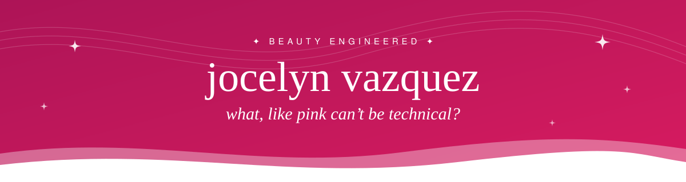
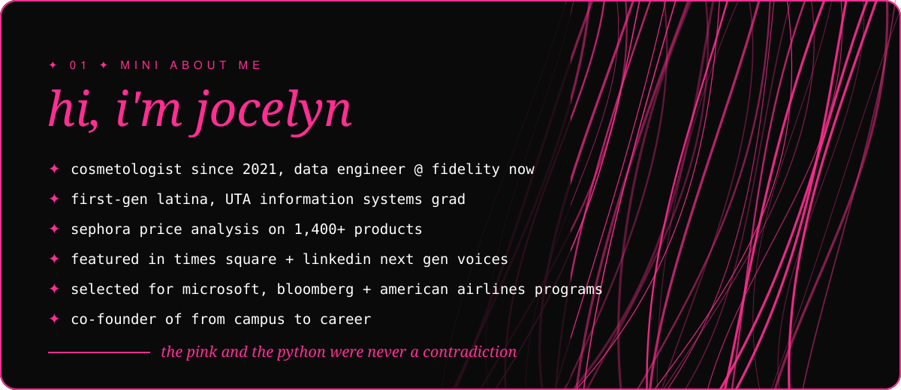

<div align="center">


<br/>


</div>

<br/>

<table>
<tr>
<td width="42%" valign="middle">

</td>
<td width="58%" valign="middle">

```text
jocelyn@beautyengineered
------------------------
💼 data engineer @ fidelity
🎓 UTA grad, info systems
💄 licensed cosmetologist
💗 co-founder, campus to career
🐍 python, sql, java
📡 learning kafka + ELK
💅🏽 dress code: pink, always
🎀 underestimated, then undefeated
```

</td>
</tr>
</table>

<div align="center">

<kbd>B</kbd> <kbd>E</kbd> <kbd>A</kbd> <kbd>U</kbd> <kbd>T</kbd> <kbd>Y</kbd> &nbsp; <kbd>✦</kbd> &nbsp; <kbd>E</kbd> <kbd>N</kbd> <kbd>G</kbd> <kbd>I</kbd> <kbd>N</kbd> <kbd>E</kbd> <kbd>E</kbd> <kbd>R</kbd> <kbd>E</kbd> <kbd>D</kbd>

<sub>💗 dressed in pink, built on data 💗</sub>

</div>

## 01 ✦ about me



## 02 ✦ the kit

<div align="center">

<sub><b>✦ WHAT I KNOW ✦</b></sub>

<br/><br/>


<br/><br/>

<sub><b>✦ CURRENTLY LEARNING ✦</b></sub>

<br/><br/>


<br/><br/>

| 💻 the engineering side | 💅🏽 the beauty side |
| :---: | :---: |
| data pipelines | precision cuts |
| SQL + data modeling | color theory |
| testing + validation | client consultations |
| storytelling with data | content creation |

</div>

## 03 ✦ featured work

- 💄 [**Cosmetic Price Analysis**](https://github.com/VazquezJocelyn/Cosmetic-Price-Analysis): where my two worlds meet, analyzing beauty product pricing with data
- ⚽ **World Cup Panini Simulation** *(in progress)*: the coupon collector problem, but make it fútbol
- 🎓 [**From Campus to Career**](https://fromcampuscareer.com): career resources for first-gen and underrepresented students

## 04 ✦ currently

- 🧪 leveling up as a data engineer in Fidelity's LEAP Program
- 📡 learning streaming + search with Kafka and the Elastic (ELK) stack
- 🎥 turning tech concepts into content people actually want to watch at [**@beautyengineered**](https://beacons.ai/beautyengineered)
- 📚 open to collabs on data projects, first-gen career content, and anything pink

## 05 ✦ let's connect

<div align="center">

<a href="https://beacons.ai/beautyengineered"></a>
<a href="https://www.linkedin.com/in/jocelyn-vazquez/"></a>
<a href="https://www.instagram.com/beautyengineered"></a>
<a href="https://www.tiktok.com/@beautyengineered"></a>
<a href="https://fromcampuscareer.com"></a>

</div>

## 06 ✦ the receipts

<div align="center">


<br/><br/>

<sub><b>✦ PINK PAC-MAN EATING MY COMMITS ✦</b></sub>

<br/><br/>

<picture>
  <source media="(prefers-color-scheme: dark)" srcset="https://raw.githubusercontent.com/VazquezJocelyn/VazquezJocelyn/output/pacman-contribution-graph-dark.svg">
  
</picture>

<br/>

<sub>✨ 💅🏽 &nbsp; pink is a power color &nbsp; 💅🏽 ✨</sub>

</div>


