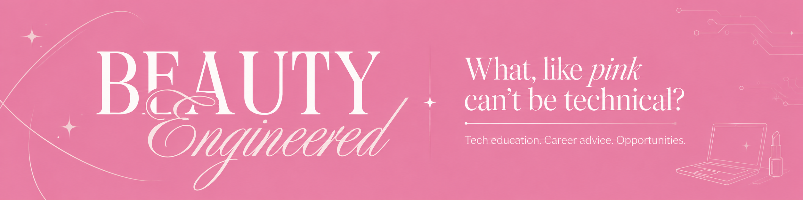
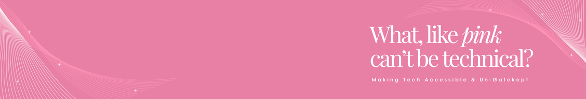

<div align="center">


<sub>✦ &nbsp; ISSUE NO. 01 &nbsp; ✦ &nbsp; THE PIVOT ISSUE &nbsp; ✦ &nbsp; DFW, TX &nbsp; ✦</sub>

<br/><br/>


</div>

<br/>

<div align="center">

### table of contents

<kbd>01</kbd> the editor &nbsp;&nbsp; <kbd>02</kbd> the kit &nbsp;&nbsp; <kbd>03</kbd> featured work &nbsp;&nbsp; <kbd>04</kbd> currently &nbsp;&nbsp; <kbd>05</kbd> connect &nbsp;&nbsp; <kbd>06</kbd> the receipts

</div>

---

## 01 ✦ the editor

<table>
<tr>
<td width="40%" valign="middle">

</td>
<td width="60%" valign="middle">

```text
jocelyn@beautyengineered
------------------------
💼 Associate Data Engineer @ Fidelity (LEAP)
🎓 B.S. Information Systems, UT Arlington
💄 Licensed TX cosmetologist since 2021
🚀 Co-founder, From Campus to Career
🐍 Languages: Python, SQL, Java
⚽ Building: World Cup sticker simulation
🎀 Motto: underestimate me, it's more fun
```

</td>
</tr>
</table>

I was doing hair before I ever wrote a line of SQL. People didn't always expect the cosmetologist to become the data engineer, and that's exactly what makes it fun. Same eye for detail, same obsession with a flawless finish, just pointed at pipelines now. I share everything I learn so the next first-gen girl doesn't have to figure it out alone.

## 02 ✦ the kit

<div align="center">


<br/><br/>

| 💻 the engineering side | 💅🏽 the beauty side |
| :---: | :---: |
| data pipelines | precision cuts |
| SQL + data modeling | color theory |
| testing + validation | client consultations |
| storytelling with data | content creation |

</div>

## 03 ✦ featured work

- 💄 [**Cosmetic Price Analysis**](https://github.com/VazquezJocelyn/Cosmetic-Price-Analysis): where my two worlds meet, analyzing beauty product pricing with data
- ⚽ **World Cup Panini Simulation** *(in progress)*: the coupon collector problem, but make it fútbol
- 🎓 [**From Campus to Career**](https://fromcampuscareer.com): career resources for first-gen and underrepresented students

## 04 ✦ currently

- 🧪 leveling up as a data engineer in Fidelity's LEAP Program
- 🎥 turning tech concepts into content people actually want to watch at [**@beautyengineered**](https://beacons.ai/beautyengineered)
- 📚 open to collabs on data projects, first-gen career content, and anything pink

## 05 ✦ connect

<div align="center">

<a href="https://beacons.ai/beautyengineered"></a>
<a href="https://www.linkedin.com/in/jocelyn-vazquez/"></a>
<a href="https://www.instagram.com/beautyengineered"></a>
<a href="https://www.tiktok.com/@beautyengineered"></a>
<a href="mailto:itsbeautyengineered@gmail.com"></a>
<a href="https://fromcampuscareer.com"></a>

</div>

## 06 ✦ the receipts

<div align="center">


</div>

<br/>


